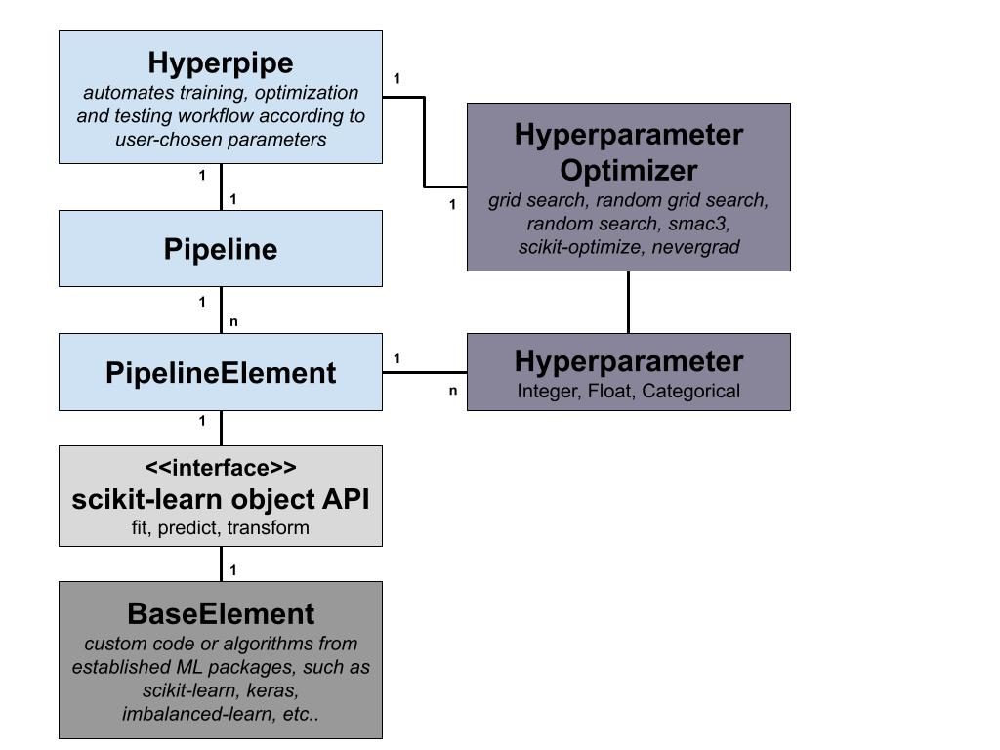

# Reasons to Use PHOTONAI
* It allows researchers to build, optimize and evaluate machine learning pipelines with 
  few lines of code.
* It automates the training, optimization and test workflow according to user-defined parameters.
* It offers convenient access to established machine learning toolboxes such as sklearn.
* It facilitates machine learning applications for researchers with little programming experience.
* Users can select and change hyperparameter optimization strategies with simple keywords.
* It is built on clean interfaces and therefore fully customizable.
* It is easily extendable with custom algorithms, e.g. for handling biomedical data modalities.
* It acts as a unifying framework to help researchers share and reuse code across projects. 
* It offers both simple and parallel pipeline streams for comparing algorithms, 
  combining features and building ensembles.
* It extends existing pipeline implementations to enable the developer, e.g. to change the dataset (data augmentation
  within the training and testing cross validation splits at runtime.
* It enables rapid prototyping in contexts which require iterative evaluation of novel machine learning models.

and many others...

## Class diagram

## Basic structure 
The PHOTONAI framework is built to accelerate and simplify the design of machine learning pipelines and automatize the 
training, testing and hyperparameter optimization process. The most important class is the _Hyperpipe_, as it is used to 
parametrize and control both the pipeline and the training and testing workflow. The _Pipeline_ streams data through a 
sequence of _PipelineElements_, the latter of which represent either established or custom algorithm implementations 
(_BaseElement_). _PipelineElements_ can share a position within the data stream via an And-Operation (_Stack_), an 
Or-Operation (_Switch_) or represent a parallel sub-pipeline (_Branch_).